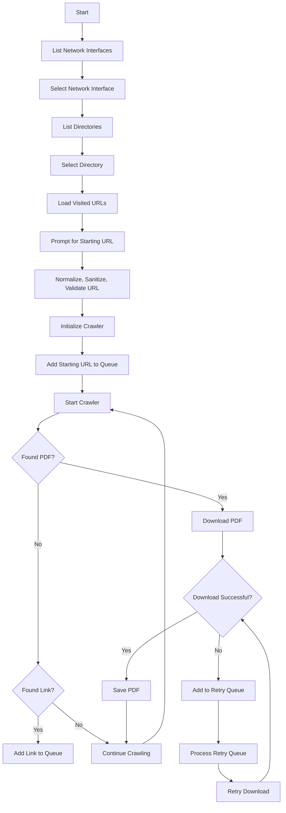

# Web Crawler for PDF Download

This Go program is a web crawler designed to traverse websites starting from a given URL, identify PDF files, and download them to a specified directory. The crawler uses the `colly` library for web scraping and supports both HTTP/HTTPS and FTP protocols. It also includes features like URL normalization, domain exclusion, and retry mechanisms for failed downloads.

## Features

- **Web Crawling**: Traverses websites starting from a given URL.
- **PDF Download**: Identifies and downloads PDF files.
- **Domain Exclusion**: Excludes specified domains from crawling.
- **URL Normalization**: Ensures URLs are properly formatted.
- **Retry Mechanism**: Retries failed downloads after a delay.
- **HTTP/3 Support**: Uses QUIC for HTTP/3 connections.
- **Concurrency**: Utilizes multiple threads for efficient crawling.

## How It Works

1. **Network Interface Selection**: The program lists available network interfaces and prompts the user to select one. This interface is used for all network operations.

2. **Directory Selection**: The user is prompted to select a directory for storing downloaded PDFs. If no directory is selected, a new one is created with a timestamp.

3. **Starting URL**: The user provides a starting URL for the crawler. The URL is normalized, sanitized, and validated before use.

4. **Crawling**: The crawler visits the starting URL and follows all links on the page. It checks each link to see if it points to a PDF file or another webpage.

5. **PDF Download**: When a PDF link is found, the file is downloaded to the selected directory. If the download fails, the URL is added to a retry queue.

6. **Retry Mechanism**: The program periodically checks the retry queue and attempts to download any previously failed files.

7. **Visited URLs**: The program keeps track of visited URLs to avoid reprocessing them.

## Code Structure

### Main Functions

- **main()**: Initializes the program, prompts for user input, and starts the crawler.
- **loadVisitedURLs()**: Loads previously visited URLs from a file.
- **hasVisited()**: Checks if a URL has already been visited.
- **saveVisitedURL()**: Saves a URL to the visited URLs file.
- **downloadFileWithTimeout()**: Downloads a file from a given URL with a timeout.
- **downloadHTTPFileWithTimeout()**: Handles HTTP/HTTPS downloads.
- **downloadFTPFile()**: Handles FTP downloads.
- **processDelayedQueue()**: Processes the retry queue for failed downloads.
- **isExcludedDomain()**: Checks if a domain is in the exclusion list.
- **getInterfaceIP()**: Retrieves the IP address of the selected network interface.
- **normalizeURL()**: Normalizes a URL to ensure it has the correct format.
- **sanitizeURL()**: Sanitizes a URL to handle invalid characters.
- **validateURL()**: Validates a URL to ensure it is usable.

### Dependencies

- **colly**: Web scraping library.
- **quic-go**: QUIC protocol implementation for HTTP/3.
- **net/http**: Standard HTTP client and server implementations.
- **net**: Low-level network operations.
- **os**: Operating system interactions (file handling, directory creation, etc.).
- **sync**: Synchronization primitives (e.g., `sync.Map` for concurrent access).
- **time**: Time-related operations (e.g., timeouts, delays).

## Mermaid Diagram

## Usage

1. **Run the Program**: Execute the program using `go run main.go`.

2. **Select Network Interface**: Choose a network interface from the list.

3. **Select Directory**: Choose a directory for storing downloaded PDFs or create a new one.

4. **Enter Starting URL**: Provide the URL from which the crawler should start.

5. **Monitor Progress**: The program will log its progress, including visited URLs and downloaded PDFs.

6. **Review Downloaded Files**: Check the selected directory for downloaded PDFs.

## Notes

- **Excluded Domains**: The program excludes certain domains by default (e.g., Facebook, YouTube). Modify the `excludedDomains` slice to change this behavior.
- **Timeout**: The download timeout is set to 10 seconds. Adjust the `downloadTimeout` constant if needed.
- **Concurrency**: The program uses 32 consumer threads for the queue. Adjust the queue size and number of threads based on your system's capabilities.

## License

This project is open-source and available under the MIT License.
