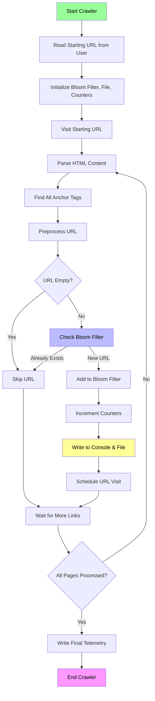

#Process Explanation:
Initialization: The crawler starts by reading the input URL and initializing components:

Bloom filter for duplicate detection

Output file for results

Counters for telemetry

HTML Parsing: For each page visited, the crawler extracts all anchor tags (<a href>)

URL Processing:

Preprocesses URLs to handle variations (www, http/https, etc.)

Checks if URL is valid

Uses Bloom filter to detect duplicates

Output Handling:

New URLs are written to both console and file

Counters are updated for telemetry

URLs are scheduled for visiting

Completion: When all pages are processed, final telemetry is written and the crawler exits

The Bloom filter acts as a probabilistic cache that prevents revisiting the same URL, while the file output provides a persistent record of all unique URLs discovered during the crawl.
#
