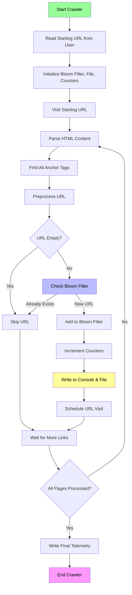
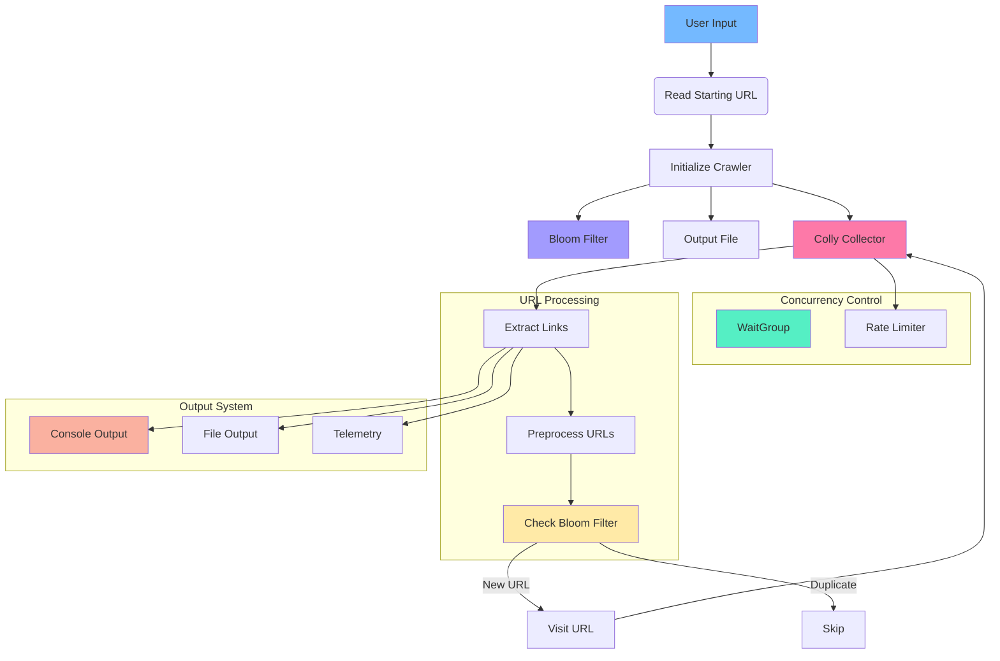

#Process Explanation:
Initialization: The crawler starts by reading the input URL and initializing components:

Bloom filter for duplicate detection

Output file for results

Counters for telemetry

HTML Parsing: For each page visited, the crawler extracts all anchor tags (<a href>)

URL Processing:

Preprocesses URLs to handle variations (www, http/https, etc.)

Checks if URL is valid

Uses Bloom filter to detect duplicates

Output Handling:

New URLs are written to both console and file

Counters are updated for telemetry

URLs are scheduled for visiting

Completion: When all pages are processed, final telemetry is written and the crawler exits

The Bloom filter acts as a probabilistic cache that prevents revisiting the same URL, while the file output provides a persistent record of all unique URLs discovered during the crawl.
#

# Go Web Crawler Architecture

Visualizing the structure and dependencies of the concurrent web crawler.

---

## System Architecture

Go Version & Dependencies
Required Go Version
The code requires Go 1.16 or later due to its use of specific standard library features and module support.

Dependencies
The crawler uses these external packages:

github.com/gocolly/colly - Web scraping framework
github.com/willf/bloom - Bloom filter implementation
Key Features
Concurrent crawling with configurable parallelism
Bloom filter for efficient duplicate URL detection
URL normalization and preprocessing
Real-time telemetry and progress reporting
Persistent output to timestamped files
Respectful crawling with rate limiting
Sample go.mod
module my-crawler go 1.21 require ( github.com/gocolly/colly v1.2.0 github.com/willf/bloom v2.0.3+incompatible )
