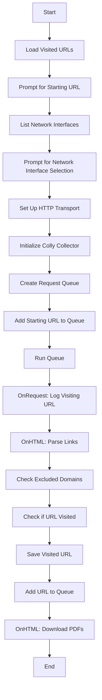

### Git Repository Description

The `qcrawl.go` program is a web crawler written in Go. It uses the `colly` library to crawl web pages starting from a user-provided URL. The program supports selecting a network interface, excluding certain domains, and downloading PDF files found during the crawl.

### Git Repository Structure

```plaintext
qcrawl/
├── main.go
├── visitedURLs.txt
├── README.md
├── go.mod
├── go.sum
└── .gitignore
```

### Bash Tree Dir Type Pseudo Code Output

```bash
qcrawl/
├── main.go
├── visitedURLs.txt
├── README.md
├── go.mod
├── go.sum
└── .gitignore
```

### Mermaid File for Program Operation



### Compilation Synopsis

To compile and run the `qcrawl.go` program, follow these steps:

1. **Clone the Repository**:
    ```bash
    git clone https://github.com/yourusername/qcrawl.git
    cd qcrawl
    ```

2. **Initialize Go Module**:
    ```bash
    go mod init qcrawl
    ```

3. **Install Dependencies**:
    ```bash
    go get -u github.com/gocolly/colly
    ```

4. **Compile the Program**:
    ```bash
    go build -o qcrawl main.go
    ```

5. **Run the Program**:
    ```bash
    ./qcrawl
    ```

### Additional Files

- **`visitedURLs.txt`**: A file to store visited URLs.
- **`README.md`**: Documentation for the project.
- **`.gitignore`**: Specifies files and directories to ignore in version control.

### `.gitignore` Example

```plaintext
# Binaries for programs and plugins
*.exe
*.exe~
*.dll
*.so
*.dylib

# Go files
*.o
*.out
*.test
*.test.exe
*.a
*.log

# Visited URLs file
visitedURLs.txt
```

### `README.md` Example

```markdown
# qcrawl

`qcrawl` is a web crawler written in Go using the `colly` library. It allows you to crawl web pages starting from a user-provided URL, select a network interface, exclude certain domains, and download PDF files found during the crawl.

## Features

- Crawl web pages starting from a user-provided URL.
- Select a network interface for the HTTP transport.
- Exclude certain domains from being crawled.
- Download PDF files found during the crawl.

## Installation

1. Clone the repository:
    ```bash
    git clone https://github.com/yourusername/qcrawl.git
    cd qcrawl
    ```

2. Initialize the Go module:
    ```bash
    go mod init qcrawl
    ```

3. Install dependencies:
    ```bash
    go get -u github.com/gocolly/colly
    ```

4. Compile the program:
    ```bash
    go build -o qcrawl main.go
    ```

5. Run the program:
    ```bash
    ./qcrawl
    ```

## Usage

1. Enter the starting URL to crawl.
2. Select the network interface to use.
3. The program will start crawling and downloading PDF files found during the crawl.

## Contributing

Feel free to open issues and submit pull requests.

## License

This project is licensed under the MIT License.
```

This setup provides a comprehensive overview of the `qcrawl.go` program, including its structure, operation, and compilation steps.
